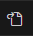
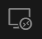
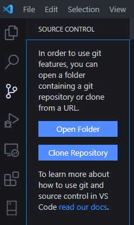
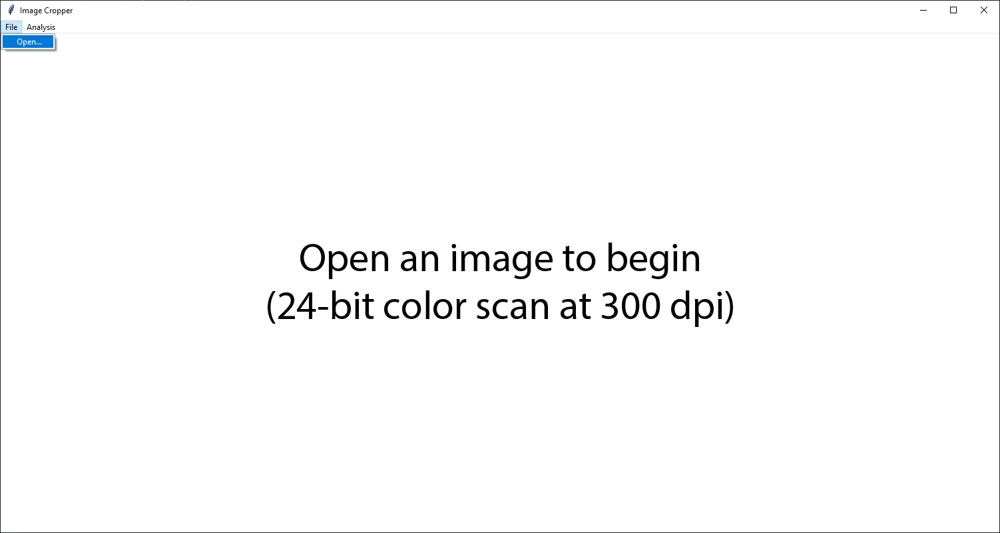
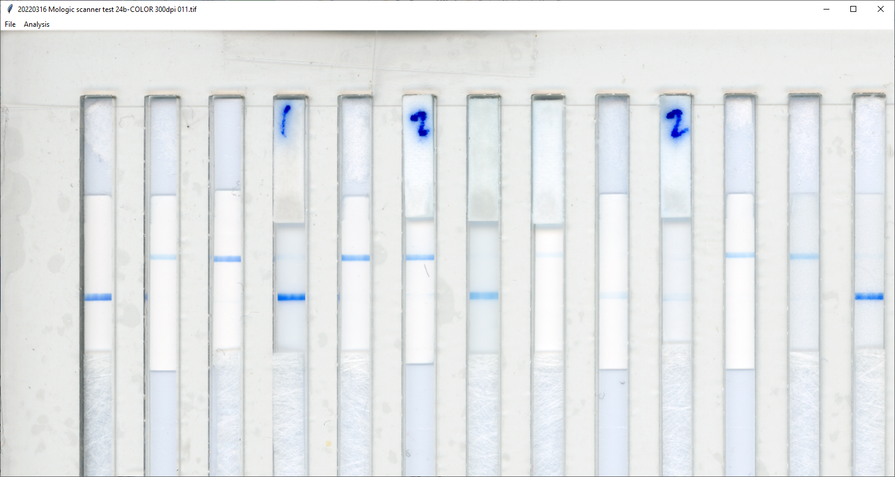
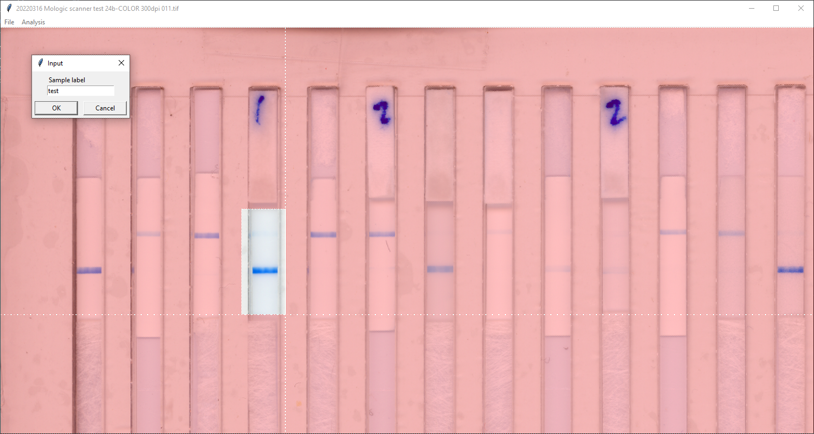
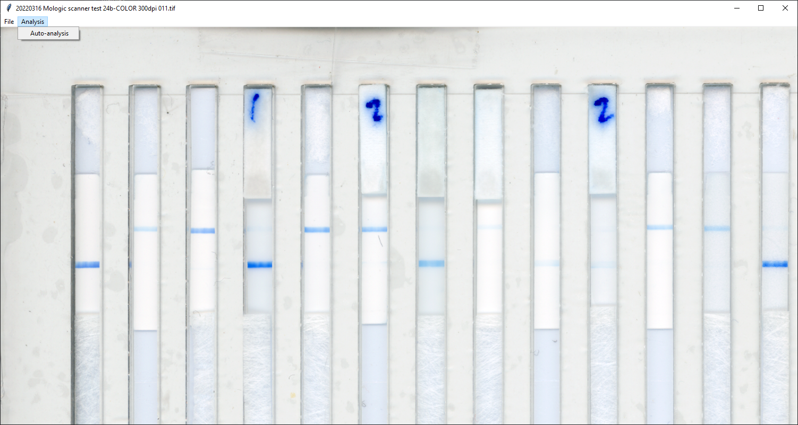
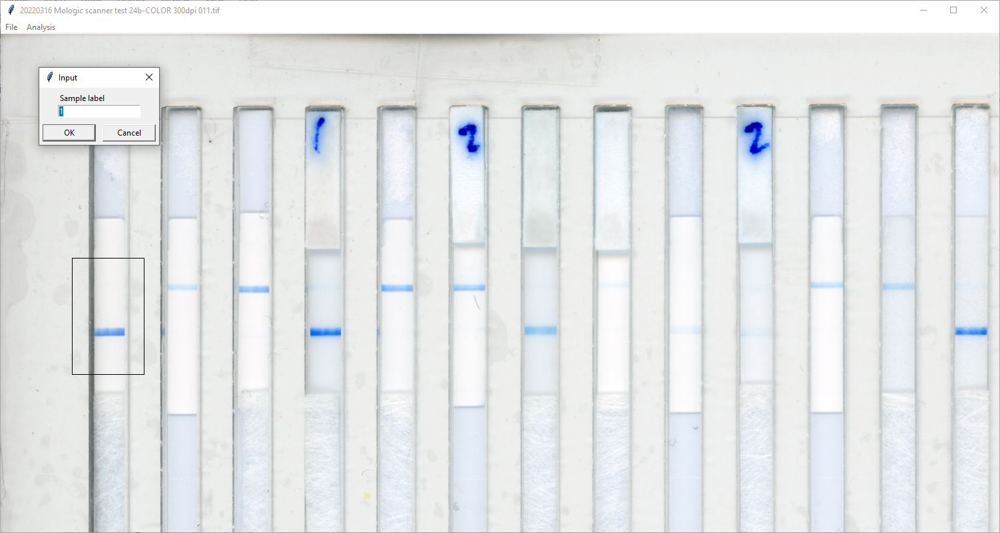

# LFA_GUI

**Purpose**
<br>Capture quantitative line intensity measurements from in-house LFAs using the Epson Perfection V800 Photo Scanner + LFA Jig + Python Reader Code from Wenbo Wang

# IDE Setup
Install VS Code (System Installer 64bit) from [here](https://code.visualstudio.com/download#) <br>
 <br>

Make sure to leave these selections ON. After installation, restart your computer.

# For PowerShell Users
## Install Anaconda
Install Anaconda (Python distribution) from [here](https://www.anaconda.com/download) <BR>
&nbsp;&nbsp;&nbsp;&nbsp; Select to install for "All Users"

## PowerShell Setup
Open VS Code and press "Ctrl" + "," This will open up the settings page. Then click  icon in the upper right corner. <BR>

Add the code below to the settings.json file:
```
"terminal.integrated.defaultProfile.windows": "PowerShell",
"terminal.integrated.profiles.windows": {
    "PowerShell": {
        "source": "PowerShell",
        "icon": "terminal-powershell",
        "args": [
            "-ExecutionPolicy",
            "ByPass",
            "-NoExit",
            "-Command",
            "& C:\\ProgramData\\Anaconda3\\shell\\condabin\\conda-hook.ps1"
        ]
    }
    }
```
>The location "C:\\ProgramData\\Anaconda3 is specific to the "All Users" installation, so if you didn't install Anaconda exactly that way, you'll have to replace that location with the location of your Anaconda installation.

Restart your machine to complete the setup.

# For WSL Users
## WSL Setup
Search for "PowerShell" and open it in administrator mode. <BR>

Enter the command ```wsl --install``` and then restart your machine

Open VS Code and click on  icon to open a new window with Ubuntu.

## MicroMamba Setup
Start your VS Code and open up the Ubuntu terminal (Ctrl-Shift-~). <BR>

Get the executable using the code below: <BR>
```wget https://github.com/conda-forge/miniforge/releases/download/24.3.0-0/Mambaforge-24.3.0-0-Linux-x86_64.sh``` <BR>
Execute the file by running the code: ```bash Mambaforge-Linux-x86_64.sh```<BR>

Restart your machine to complete the setup.

# Clone Repository
Copy the link below:<BR>
```https://github.com/Global-Health-Labs/LFA_GUI/```

Open VS Code and go to the "Source Control" tab (Ctrl-Shift-G) on the left navigation bar in VS Code and click the "Clone Repository" button. 
<BR>
Paste in the URL you copied and press the "Enter" key on your keyboard

# Environment Setup
Run the code below to setup the environment:<BR>
```conda env create -f environment.yml```

Activate the environment using ```conda activate lfagui```

# Software Execution

### Option 1:<BR>
Go to the "File Explorer" tab (Ctrl-Shift-E) on the left navigation bar in VS Code and then double-click the "main.py" file in the LFA_GUI repository to open that file in the main panel of VS Code. <BR>
Click the "Play" arrow icon in the upper right of VS Code to run the LFA_GUI application.

### Option 2: <BR>
Use terminal to change the directory to ```LFA_GUI```<BR>
Run ```main.py``` using the code ```python main.py```

### Analysis
Click "File" > "Open..." in the "Image Cropper" application<BR>


Browse to and open a PNG or TIF image file (preferably a TIF file scanned in 24-bit color at 300 dpi)<BR>


To capture data from a single LFA:<BR>
&nbsp;&nbsp;&nbsp;&nbsp; Drag a rectangle around the analytical pad of an LFA in the image<BR>
&nbsp;&nbsp;&nbsp;&nbsp; Enter a label (or accept the default label, which is the indexed count of the rectangle you drew)<BR> Press "OK" to capture data in the rectangle you drew or "Cancel" to not capture data<BR>



To capture data from multiple LFAs produced for the Mologic project:<BR>
&nbsp;&nbsp;&nbsp;&nbsp; Click "Analysis" > "Auto analysis"<BR>


&nbsp;&nbsp;&nbsp;&nbsp; Enter a label (or accept the default label, which is the indexed count of the rectangle you drew)<BR>


&nbsp;&nbsp;&nbsp;&nbsp; Press "OK" to capture data in the rectangle on the screen or "Cancel" to skip capturing data for that rectangle<BR>
&nbsp;&nbsp;&nbsp;&nbsp; Repeat for each rectangle drawn on the screen (which should correspond to the analytical pad of each in-house Mologic oligo LFA in each jig cut-out)

# Find your Data
Open the subfolder in the location of your image file with the same name as your image file<BR>
Open the CSV file with the name of your image file to see the top three peak and background (average of lowest 50 points in intensity profile) signals in the gray, red, green, and blue color channels for each rectangle you have captured<BR>
Open the PNG file with the concatenated name of your image file and label to see the automated image cropping and width-averaged intensity profiles for that capture data<BR>